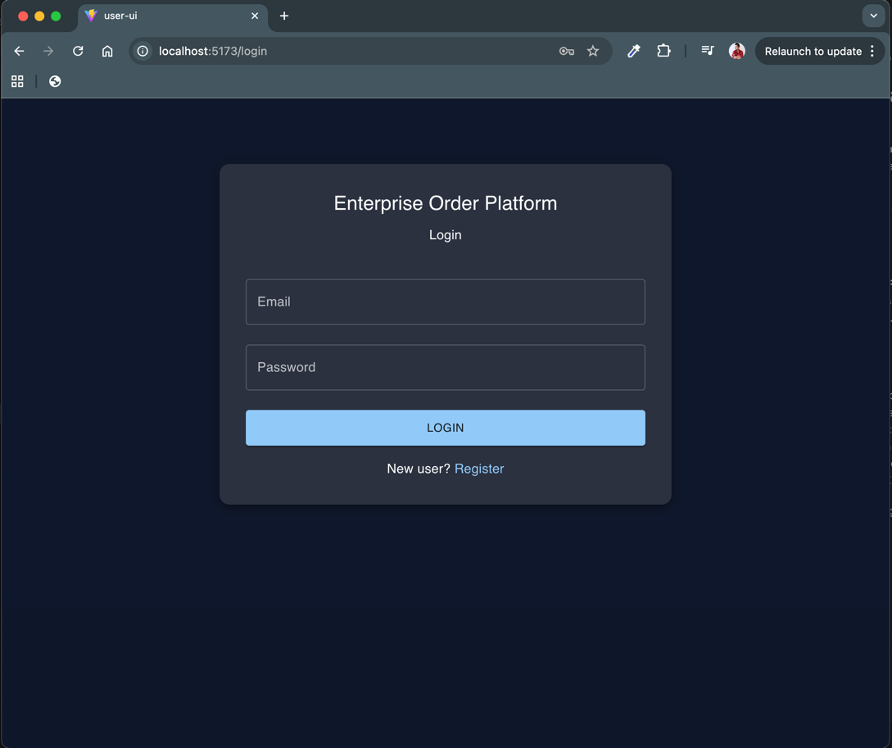
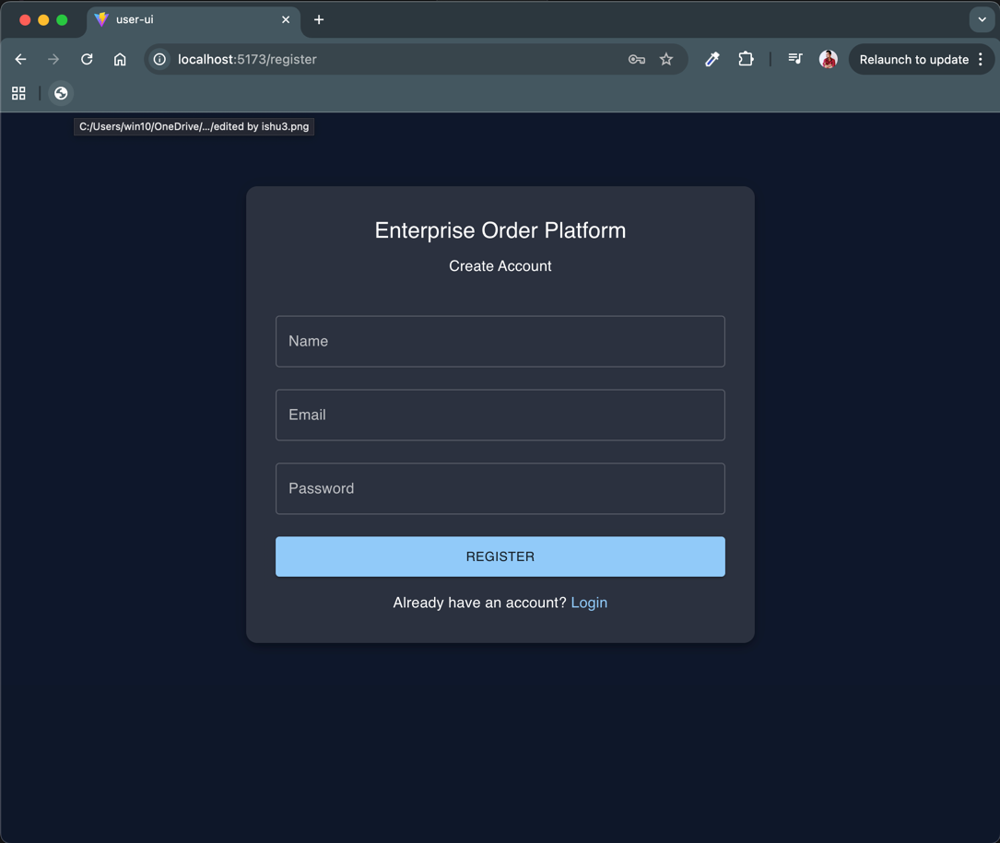
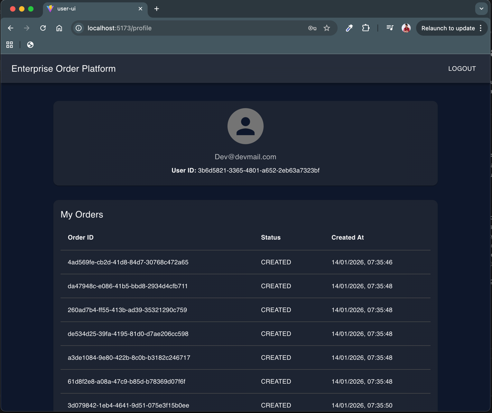

# Enterprise Order Microservices Platform

**Author:** Devendra Singh  
**Architecture:** Event-Driven, Cloud-Ready Microservices  
**Tech Stack:** Spring Boot, Kafka (Redpanda), PostgreSQL, Docker, Prometheus, Grafana

---

## 📌 Overview

The **Enterprise Order Microservices Platform** is a production-style, event-driven backend system designed to demonstrate how modern cloud-native applications are built in real organizations.

It implements:

- User Registration & Authentication
- Order Creation, Cancellation, Approval Flow
- Asynchronous Event Processing using Kafka (Redpanda)
- Centralized Persistence using PostgreSQL
- Observability with Prometheus & Grafana
- Containerized Deployment using Docker Compose
- Ready for Kubernetes & Cloud (EKS / AKS / GKE)

This project follows real enterprise design principles:

- Microservices Architecture
- Event-Driven Communication
- Separation of Concerns
- Observability-First Design
- Cloud-Native Readiness

---


---

```
## 🏗 High Level Architecture

```text
Client
  |
  v
+----------------+
| User Service   |
+----------------+
  |
  v
+----------------+
| Order Service  |
+----------------+
  |
  | (Kafka Events)
  v
+----------------+
| Redpanda       |
| (Kafka)        |
+----------------+
  |
  v
+------------------------+
| Notification Service  |
+------------------------+

Databases:
- User Service  ---> PostgreSQL (userdb)
- Order Service ---> PostgreSQL (orderdb)

Monitoring:
Prometheus  --->  Grafana

## User Interface

### Login Page


### Registration Page


### Profile & Orders

```

## 🧩 Microservices

### 1. User Service
**Port:** 8090

Responsibilities:
- User Registration
- Login
- Profile Management
- User Identity for Orders

---

### 2. Order Service
**Port:** 8081

Responsibilities:
- Order Creation (linked with User ID)
- Order Cancellation
- Order Approval
- Order Status Lifecycle
- Publishing Order Events to Kafka

---

### 3. Notification Service
**Port:** 8082

Responsibilities:
- Consumes Order Events from Kafka
- Sends Notifications (Email/SMS/Push – extendable)
- Stores Delivery Status

---

### 4. Redpanda (Kafka Compatible Broker)
**Port:** 9092

Purpose:
- Event Streaming Platform
- Decouples Order Processing from Notification
- Enables future services like Billing, Inventory, Analytics

---

### 5. PostgreSQL
**Port:** 5433

Databases:
- `userdb`
- `orderdb`

---

### 6. Prometheus
**Port:** 9090

Collects:
- JVM Metrics
- API Latency
- Error Rates
- Kafka Consumer Lag

---

### 7. Grafana
**Port:** 3000

Visualizes:
- System Health
- Service Performance
- Throughput & Failures

---

## 🛠 Technology Stack

| Layer | Technology |
|------|------------|
| Language | Java, Kotlin |
| Framework | Spring Boot |
| Messaging | Kafka (Redpanda) |
| Database | PostgreSQL |
| Containerization | Docker |
| Orchestration (Future) | Kubernetes |
| Monitoring | Prometheus |
| Visualization | Grafana |
| Cloud Target | AWS EKS / Azure AKS / GCP GKE |

---

## ▶️ Running Locally

### Prerequisites
- Docker
- Docker Compose

### Start the System
**From root directory**
```./scripts/start-local.sh  ```


docker compose up

| Service          | URL                                            |
| ---------------- | ---------------------------------------------- |
| Order API        | [http://localhost:8081](http://localhost:8081) |
| User API         | [http://localhost:8090](http://localhost:8090) |
| Notification API | [http://localhost:8082](http://localhost:8082) |
| Prometheus       | [http://localhost:9090](http://localhost:9090) |
| Grafana          | [http://localhost:3000](http://localhost:3000) |

Username: admin
Password: admin


---
### Event Flow Example
- User creates an order via Order Service

- Order is saved in PostgreSQL

- OrderCreatedEvent is published to Kafka

- Notification Service consumes the event

- Notification is triggered (Email/SMS/Push)

- Metrics are collected by Prometheus

- Grafana visualizes throughput and latency

### Current Features
- User Registration & Login

- Profile Management

- Order Creation linked to User

- Order Cancellation

- Order Approval Flow

- Kafka-based Event Propagation

- Centralized Observability (Metrics & Dashboards)


## 🔁 Event Flow

1. User creates an order
2. Order is saved in PostgreSQL
3. `OrderCreatedEvent` is published to Kafka
4. Notification Service consumes the event
5. Notification is triggered
6. Prometheus collects metrics
7. Grafana visualizes performance

---

## ✅ Current Features

- User Registration & Login
- Profile Management
- Order Creation with User Mapping
- Order Cancellation
- Order Approval
- Kafka Event Streaming
- Centralized Observability

---

## 🚀 Roadmap

### Phase 1 – Business Completion
- Order State Machine (CREATED → APPROVED → SHIPPED → DELIVERED → CANCELLED)
- Role-Based Access (Admin / User)
- JWT Security

### Phase 2 – UI
- User Portal
- Admin Dashboard

### Phase 3 – Cloud Native
- Kubernetes Deployment
- Ingress Controller
- Auto-Scaling
- ConfigMaps & Secrets
- Distributed Tracing

### Phase 4 – DevOps
- CI/CD Pipeline
- Canary Deployment
- Chaos Engineering
- Multi-Region Setup

---

## 👨‍💻 Author

**Devendra Singh**  
Senior Mobile & Backend Engineer  
Specialization: Cloud-Native Microservices, Distributed Systems, Event Streaming, Kubernetes Architecture
